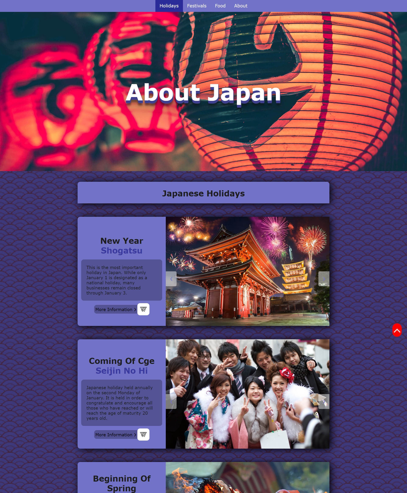
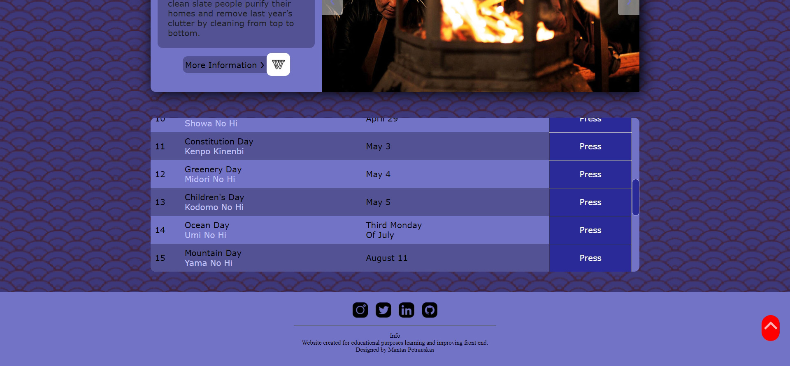

# About Japan

 
 

 

 

 

Website published at: http://www.aboutjapan.info/

Static website was created using HTML, CSS, SCSS, JavaScript.
Was used Visual Studio Code SCSS plugin compiler to make css.

Website created for educational purposes
learning and improving front end.

Designed and created by Mantas Petrauskas https://github.com/mantodinas

